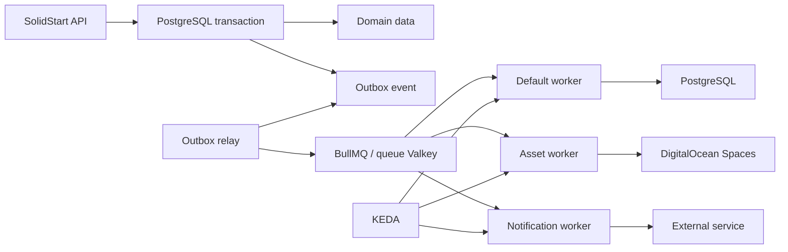

# Kata Architecture Reference

`kata`는 제품명이 확정되기 전까지 사용하는 작업명이다. `apps/kata`는 이 저장소의 새 메인 풀스택 앱으로 둔다. 목표는 운영 안정성을 우선하면서도 배포부터 실제 사용자 노출까지의 시간을 짧게 유지하는 것이다.

이 문서는 장기 아키텍처 결정과 기능별 설계 기준을 보관한다. 실제 구현 순서와 비용 경계는 [Kata Execution Plans](./README.md)와 각 Phase 문서를 따른다. 아래 `Workstream` 번호는 실행 순서를 의미하지 않으며, 필요한 기능을 어느 실행 Phase에서 다룰지는 각 Phase 문서가 결정한다.

## Core Principles

- 배포와 릴리즈를 분리한다. 코드는 자주 배포하고, 사용자 노출은 feature flag로 제어한다.
- Kubernetes 구성은 선언형으로 관리하되, GitOps 과정이 배포 속도의 병목이 되지 않게 한다.
- 데이터베이스, 사용자 업로드 아셋, 빌드 아셋은 서로 다른 수명 주기와 캐시 정책을 가진다.
- 초기에는 복잡도를 제한하고, 각 단계가 다음 단계로 자연스럽게 확장되도록 구성한다.
- 신규 구성요소는 유지보수 중인 stable release만 사용한다. 보관 처리되었거나 지원이 종료된 프로젝트는 새 구성에 넣지 않는다.

## Decisions

- Cloud provider는 DigitalOcean을 우선 사용한다.
- Infrastructure as Code는 OpenTofu를 사용한다. Remote state는 production과 non-production을 분리한 private DigitalOcean Spaces bucket에 저장하고, bucket versioning과 native S3 lockfile을 사용한다.
- Kubernetes는 로컬에서 k3d로 먼저 학습하고, cloud 환경은 DigitalOcean Kubernetes(DOKS)로 확장한다.
- North-south traffic은 Kubernetes Gateway API로 관리한다. DOKS에서는 관리형 Cilium Gateway API를 사용하고, local k3d에서도 Cilium Gateway API를 재현한다.
- Primary DB provider는 DigitalOcean Managed PostgreSQL로 둔다.
- Cache provider는 초기에는 로컬 또는 cluster 내부 Valkey로 시작하고, cloud 환경에서는 DigitalOcean Managed Valkey를 사용한다.
- Background job은 BullMQ를 사용하고, production에서는 cache와 분리된 queue 전용 DigitalOcean Managed Valkey를 사용한다.
- PostgreSQL을 background job 상태의 복구 기준으로 두고, 업무 데이터와 작업 발행은 Transactional Outbox로 연결한다.
- Worker는 Kubernetes `Deployment`로 실행하고, queue backlog 기반 확장은 KEDA를 사용한다.
- Object storage는 local에서는 SeaweedFS의 S3 API를 단일 노드로 사용하고, cloud 환경에서는 DigitalOcean Spaces Standard bucket과 Spaces CDN을 우선 사용한다.
- Cloudflare를 application edge와 CDN으로 사용한다. Spaces CDN은 Spaces의 public object 전용이고, Cloudflare는 DOKS의 SSR origin과 SSR이 생성한 cacheable response를 담당한다.
- Public application origin은 Cloudflare Tunnel로 비공개 연결한다. Production과 non-production은 tunnel과 credential을 분리한다.
- DB-backed public asset의 기본 CDN domain은 `media.<product-domain>` 형태로 둔다.
- Build asset과 SSR-generated asset은 Git SHA별 URL namespace와 release Service로 분리하고, 현재 release를 포함해 최대 10개를 유지한다.
- Auth provider는 Better Auth를 우선 사용한다.
- Authorization은 Better Auth에 종속시키지 않고 `apps/kata` 도메인 모델로 분리한다.
- Secrets 관리는 SOPS + age + Flux decryption을 기본값으로 둔다.
- Container registry는 DigitalOcean Container Registry를 사용한다.
- CI가 빌드한 image digest를 Git desired state에 기록하고, Flux는 Git을 읽어 Kubernetes에 적용한다. 자체 앱 image에는 Flux Image Automation을 초기 도입하지 않는다.
- Feature flag는 OpenFeature를 앱 표준 API로 두고, Unleash를 관리 서버로 검토한다.
- 초기 targeted rollout은 Cloudflare Access로 보호한 `beta.<product-domain>` hostname을 사용한다. 사용자가 제공한 header나 일반 cookie를 release routing 기준으로 신뢰하지 않는다.
- 관측 데이터의 공통 규격은 OpenTelemetry로 두고, 수집 계층은 Grafana Alloy를 우선 사용한다.
- Kubernetes network observability는 DOKS의 Cilium Hubble을 사용하고, local k3d에서도 Cilium/Hubble 구성을 단계적으로 재현한다.
- 관측 backend는 local에서 Grafana, Prometheus, Loki, Tempo를 사용하고, production에서는 Grafana Cloud를 우선 검토한다.
- 운영 진단은 dashboard와 함께 읽기 중심 MCP를 제공한다. 초기에는 Coroot MCP를 실험하고, 여러 운영 시스템을 통합하는 전용 MCP는 필요성이 확인된 뒤 도입한다.
- Pull Request preview DB는 DigitalOcean Managed PostgreSQL 안에 PR별 database와 user를 생성하는 방식으로 시작한다.
- Neon은 PR preview DB 운영이 복잡해지거나 branch DB가 꼭 필요해졌을 때 보조 선택지로 다시 검토한다.
- Supabase는 초기 DB provider 후보에서 제외한다. Auth, Storage, Realtime까지 묶인 BaaS 성격이 현재 운영 학습 목표와 다르다.
- `apps/*` directory는 배포 환경이 아니라 독립적으로 빌드하고 배포할 수 있는 앱을 나타낸다.
- `dev`, `staging`, `production`은 같은 앱의 배포 위치다. 앱 이름에 포함된 `dev`와 배포 환경의 `dev`는 별개다.
- 초기에는 production domain을 우선 확정한다. dev와 staging domain 규칙은 실제 환경이 필요해질 때까지 참고용으로 둔다.

## Maintenance Baseline

2026-07-11 기준으로 공식 문서, release, repository 상태를 확인했다. 실제 구현을 시작할 때 다시 확인하고 stable version을 고정한다.

| 구성요소                                             | 판단      | 기준                                                                                   |
| ---------------------------------------------------- | --------- | -------------------------------------------------------------------------------------- |
| k3d                                                  | 유지      | 2026년 6월 stable release가 있으며 local 전용으로 사용                                 |
| DOKS Cilium Gateway API                              | 채택      | DOKS가 Kubernetes 1.33 이상 VPC-native cluster에서 관리형으로 제공                     |
| ingress-nginx                                        | 제외      | 2026년 3월 지원 종료, 이후 보안 수정 없음                                              |
| SeaweedFS                                            | 채택      | S3 API와 container image를 제공하고 2026년에도 release와 보안 수정 지속                |
| MinIO Community                                      | 제외      | upstream repository가 2026년 4월 보관 처리되어 신규 기본값으로 사용하지 않음           |
| RustFS                                               | 보류      | 활발하지만 distributed mode와 lifecycle 기능이 아직 시험 단계                          |
| Flux, SOPS, KEDA, Kyverno                            | 유지      | 최신 Kubernetes 호환 범위와 release cadence를 구현 시점에 함께 고정                    |
| Better Auth, BullMQ, Unleash, OpenFeature            | 유지      | active stable release만 사용하고 beta release는 production에서 제외                    |
| OpenTelemetry, Grafana Alloy, Grafana Cloud          | 유지      | telemetry contract와 수집 경로의 기본값으로 사용                                       |
| Dagger, Kargo, Flagger, Coroot MCP, Beyla, Pyroscope | 도입 보류 | 유지보수 상태는 양호하지만 초기 필수 구성은 아니므로 명시된 진입 조건이 생길 때만 도입 |

유지보수 검토 기준:

- 분기마다 repository archive 여부, 최근 stable release, security advisory, Kubernetes 호환 범위를 확인한다.
- Kubernetes는 DOKS가 지원하는 최신 minor 또는 바로 이전 minor를 사용하고 EOL version을 사용하지 않는다.
- controller와 CRD upgrade는 release note와 rollback 방법을 확인한 뒤 dev, staging, production 순서로 적용한다.
- 6개월 이상 stable release나 security response가 없는 핵심 OSS는 대체 후보를 조사한다.
- beta, alpha, preview 기능은 production dependency로 사용하지 않는다. 예외는 위험과 제거 경로를 문서화한다.

확인 자료: [Ingress NGINX retirement](https://kubernetes.io/blog/2025/11/11/ingress-nginx-retirement/), [DOKS Gateway API](https://docs.digitalocean.com/products/kubernetes/how-to/use-gateway-api/), [MinIO repository status](https://github.com/minio/minio), [SeaweedFS releases](https://github.com/seaweedfs/seaweedfs/releases), [KEDA compatibility](https://keda.sh/docs/2.20/operate/cluster/)

## Workstream 1 - App Foundation

목표: `apps/kata`가 독립 앱으로 빌드, 실행, 검증될 수 있는 기반을 만든다.

- SolidStart 기반 SSR 앱을 `apps/kata`에 구성한다.
- 기존 모노레포 관례에 맞춰 `pnpm`, Turborepo, oxlint, oxfmt, Vitest 흐름에 연결한다.
- 같은 앱의 배포 환경은 `local`, `dev`, `staging`, `production`으로 구분한다.
- Docker image 빌드가 가능한 최소 `Dockerfile`을 준비한다.
- `/healthz`, `/readyz` 같은 Kubernetes probe용 endpoint를 둔다.
- 로컬 Kubernetes는 k3d를 기본값으로 둔다.
- k3d의 기본 Traefik과 Flannel을 사용하지 않고 Cilium CNI와 Gateway API를 설치해 DOKS routing contract를 재현한다.
- 로컬 cluster에는 Cilium Gateway API, Postgres, SeaweedFS, Valkey, Unleash를 단계적으로 올린다.

### Domain Naming

앱 식별자, 제품 domain, 배포 환경을 서로 분리한다. repository directory 이름이 public domain 구조를 자동으로 결정하지는 않는다.

제품명이 `kata`로 확정된 경우의 참고 구조:

```text
apps/kata      -> kata.com or www.kata.com
apps/dev-kata  -> dev.kata.com
apps/coong     -> 별도 서비스 domain
```

- `apps/kata`의 production canonical domain은 `kata.com`과 `www.kata.com` 중 하나만 선택하고 다른 하나는 redirect한다.
- `apps/dev-kata`가 추가된다면 `dev.kata.com`은 별도 앱의 production domain이다. 여기서 `dev`는 배포 환경을 의미하지 않는다.
- `apps/coong`처럼 제품군이 다른 앱은 별도 root domain과 운영 경계를 가진다.
- `apps/kata`의 dev와 staging 배포 주소는 별도 앱 directory를 만들지 않고 environment overlay에서 결정한다.
- dev, staging, preview, ops domain 예시는 production 구조가 확정된 뒤 정하며, 현재 단계에서는 참고 사항으로만 유지한다.
- Kubernetes resource 이름은 앱과 환경을 구분할 수 있도록 `{app}-{environment}` 형식을 사용한다.

### Environment Isolation

비용을 제한하면서 production 장애 범위를 분리하기 위해 두 개의 cloud cluster로 시작한다.

```text
local:
  k3d

non-production DOKS:
  dev namespace
  staging namespace
  Pull Request preview namespaces

production DOKS:
  production namespace only
```

- production과 non-production은 서로 다른 DOKS cluster와 VPC를 사용한다.
- production PostgreSQL은 독립 cluster로 두고 최소 한 개의 standby node를 사용한다.
- non-production PostgreSQL은 dev, staging, preview가 database와 user를 각각 분리해 공유할 수 있다.
- production cache Valkey와 queue Valkey는 각각 독립 Managed Valkey cluster로 둔다.
- non-production은 cache용과 queue용 cluster를 분리하되 dev, staging, preview가 key prefix와 queue name으로 공유할 수 있다.
- Spaces는 production과 non-production을 분리하고, 각 환경 경계 안에서도 public bucket과 private bucket을 분리한다.
- SOPS age key, Better Auth secret, database user, Spaces access key는 production과 non-production 사이에서 공유하지 않는다.
- DigitalOcean Container Registry는 공유할 수 있지만 production workload에는 pull-only credential을 사용한다.
- Cloudflare account는 공유할 수 있다. root domain이 다르면 zone을 분리하고, 같은 zone을 쓰면 DNS 변경, cache purge, zone 설정 token을 용도별 최소 권한으로 분리한다.
- namespace마다 ResourceQuota, LimitRange, NetworkPolicy, ServiceAccount를 별도로 적용한다.

### Platform Bootstrap

Cloud resource, cluster add-on, application desired state를 한 저장소에서 관리하되 책임과 적용 순서를 분리한다. Cloud resource는 OpenTofu가 관리하고 cluster 내부 resource는 Flux가 관리한다.

```text
infra/
  iac/
    modules/
    environments/
      non-production/
      production/
  clusters/
    non-production/
      flux-system/
      kustomization.yaml
    production/
      flux-system/
      kustomization.yaml
  infrastructure/
    base/
    overlays/
      non-production/
      production/
  apps/
    kata/
      base/
      overlays/
        dev/
        staging/
        production/
  policies/
```

각 directory의 책임:

- `iac`: DOKS, VPC, Managed PostgreSQL, Managed Valkey, Spaces, Container Registry와 Cloudflare resource를 생성한다.
- `clusters`: cluster별 Flux bootstrap과 최상위 reconciliation entrypoint만 둔다.
- `infrastructure`: Cilium Gateway 설정, Cloudflare Tunnel, KEDA, Grafana Alloy, Kyverno, Unleash 같은 cluster add-on을 둔다.
- `apps`: 애플리케이션 workload, Service, HTTPRoute와 환경별 image digest를 둔다.
- `policies`: 공통 ResourceQuota, LimitRange, NetworkPolicy와 admission policy를 둔다.

Bootstrap 순서:

```text
IaC cloud resources
  -> Flux bootstrap
  -> CRD and controller
  -> network, security, observability add-on
  -> namespace and policy
  -> database migration
  -> application workload
```

- IaC와 Flux의 소유권이 겹치지 않게 한다. Cloud resource는 IaC가, cluster 내부 resource는 Flux가 소유한다.
- Flux `Kustomization.spec.dependsOn`, health check와 timeout으로 적용 순서를 강제한다.
- CRD를 사용하는 resource는 해당 controller가 Ready가 된 뒤 적용한다.
- production과 non-production은 같은 base를 사용하되 cluster별 overlay와 state를 공유하지 않는다.
- bootstrap을 빈 cluster에서 반복 실행해 목표 RTO 안에 재구성되는지 분기별 복구 훈련에서 검증한다.

OpenTofu state와 실행 기준:

- State bucket은 OpenTofu가 사용할 수 있도록 최초 한 번 수동으로 생성하고 bootstrap runbook에 기록한다. Application asset bucket과 분리하며 public access와 CDN을 활성화하지 않는다.
- Production과 non-production은 별도 state bucket, state key와 Spaces credential을 사용한다. Production credential로 non-production state에 접근하거나 그 반대 방향으로 접근하지 않는다.
- State bucket에는 versioning을 활성화하고 `backend "s3"`의 `use_lockfile = true`를 사용해 동시 `plan`과 `apply`를 직렬화한다.
- OpenTofu와 provider version constraint를 선언하고 `.terraform.lock.hcl`을 Git에 커밋한다.
- CI에서 주 1회 environment별 `tofu plan -detailed-exitcode`를 실행한다. Drift가 발견되면 변경 원인을 검토하고 Pull Request로 수정하며 자동 `apply`하지 않는다.
- Renovate가 월 1회 OpenTofu provider update Pull Request를 생성한다. `tofu plan` 검토와 non-production 적용 후 7일간 관찰하고 production에 적용한다.
- Production `apply`는 승인된 Pull Request 기준으로 실행하고 state write credential과 일반 CI build credential을 분리한다.
- 초기 검증에서 동시 실행 잠금, 이전 state version 복원 후 `tofu plan`, 빈 cluster bootstrap을 각각 시험한다.

확인 자료: [DigitalOcean Spaces Terraform backend](https://docs.digitalocean.com/products/spaces/reference/terraform-backend/), [OpenTofu S3 backend](https://opentofu.org/docs/language/settings/backends/s3/)

### Workload Availability Baseline

초기 production 가용성 기준:

```text
current SSR Deployment replicas: 3
current SSR HPA min replicas: 3
current SSR HPA max replicas: 10
retained release SSR replicas: 1 per release
critical worker min replicas: 1
production worker node pool: min 3, max 6
current SSR PodDisruptionBudget: minAvailable 2
```

- 현재 SSR Pod는 `kubernetes.io/hostname` 기준으로 `maxSkew: 1`이 되도록 분산한다. DOKS가 의미 있는 복수 zone label을 제공하는 구성이면 `topology.kubernetes.io/zone` 분산을 추가한다.
- 모든 Deployment에 CPU와 memory request/limit을 지정한다. 첫 값은 부하 시험 결과로 정하고 측정 전 임의의 큰 limit을 사용하지 않는다.
- current SSR HPA는 CPU, memory와 실제 request latency를 관찰해 조정한다. Retained release Deployment는 HPA 대상에서 제외한다.
- node pool은 node 한 개가 중단되어도 current SSR 3개와 필수 platform Pod를 재배치할 여유를 유지한다.
- critical worker가 중단되면 queue가 작업을 보존하므로 min replica 1로 시작한다. 처리 지연 SLO가 필요해지면 2개 이상으로 올린다.
- rollout, node drain과 cluster upgrade 전에 PDB, topology spread와 실제 spare capacity를 함께 검증한다.

### Private Application Origin

Cloudflare Tunnel을 application edge의 기본 origin 연결로 사용한다. DOKS application origin에는 공개 IP와 공개 DNS record를 두지 않는다.

```text
user
  -> Cloudflare CDN and WAF
  -> Cloudflare Tunnel
  -> cloudflared Deployment
  -> internal Cilium Gateway
  -> HTTPRoute
  -> current or retained release Service
```

- Production과 non-production에 서로 다른 remotely-managed tunnel과 tunnel token을 사용한다.
- `cloudflared`는 cluster마다 고정 2 replicas로 실행하고 서로 다른 node에 분산한다.
- Tunnel replica는 autoscaling하지 않는다. Downscale이 기존 connection을 끊을 수 있으므로 capacity는 resource 사용량과 bandwidth를 관측해 수동으로 조정한다.
- `cloudflared`에 `PodDisruptionBudget: minAvailable 1`, readiness probe, resource request/limit과 구조화된 log를 적용한다.
- Cilium Gateway는 DigitalOcean internal load balancer로 구성하고 Cloudflare Tunnel이 내부 hostname으로 접근한다.
- Tunnel token은 environment별 SOPS encrypted Secret으로 관리하고 rotation 절차를 둔다.
- production public hostname은 tunnel로만 연결하고 origin IP를 공개 DNS, log, error response에 노출하지 않는다.
- Cloudflare Tunnel 장애, connector 수, connection 상태와 origin latency를 monitoring과 alert 대상에 포함한다.
- `media.<product-domain>`의 public DB-backed asset은 Spaces CDN을 직접 사용한다. Cloudflare Tunnel이나 Cloudflare CDN을 중복 적용하지 않는다.

확인 자료: [Cloudflare Tunnel for Kubernetes](https://developers.cloudflare.com/tunnel/deployment-guides/kubernetes/), [Cloudflare Tunnel high availability](https://developers.cloudflare.com/tunnel/configuration/), [DOKS internal Gateway](https://docs.digitalocean.com/products/kubernetes/how-to/use-gateway-api/)

## Workstream 2 - Auth And Authorization

목표: 로그인과 권한 판단을 분리하고, 조직 단위 권한 모델을 초기부터 명확히 둔다.

Better Auth는 identity, session, login flow를 담당한다. Kata authorization은 사용자가 어떤 조직과 리소스에서 어떤 행동을 할 수 있는지 판단한다.

```text
Authentication:
  Better Auth
  user, session, social login, passkey, device authorization

Authorization:
  Kata domain
  organization, membership, role, permission, resource scope, policy
```

초기 Better Auth 범위:

```text
email/password
Google social login
GitHub social login
passkey/WebAuthn
multi-session
device authorization later
```

권한 모델:

```text
permission = 실제 행동 권한
role = permission 묶음
membership = 특정 사용자가 특정 조직에서 가진 role
```

기본 관계:

```text
User
  -> Membership in Organization
    -> Role(s)
      -> Permission(s)
```

초기 role:

```text
owner
admin
member
viewer
```

초기 permission:

```text
organization:read
organization:update
member:invite
member:remove
asset:read
asset:create
asset:update
asset:delete
billing:read
billing:update
feature-flag:read
feature-flag:update
```

코드에서는 role을 직접 검사하지 않는다. role은 운영자가 관리하는 permission 묶음이고, 앱 코드는 permission을 중앙 API로만 확인한다.

```ts
await authorize(user, 'asset:delete', {
  organizationId,
  assetId,
})
```

금지할 패턴:

```ts
if (user.role === 'admin') {
  await deleteAsset()
}
```

권한 판단 입력은 항상 user, action, resource scope를 포함한다.

```text
user
action: asset:delete
scope: organizationId, projectId, assetId
```

운영 경계:

- `admin` role이 어떤 permission을 가지는지는 변경 가능해야 한다.
- role은 추가 가능해야 한다.
- 사용자는 조직별로 다른 role을 가질 수 있다.
- customer-facing permission, internal admin permission, service permission은 분리한다.
- 권한 민감 작업은 audit log를 남긴다.
- resource-level exception, temporary access, support impersonation은 나중에 확장한다.

## Workstream 3 - Data And Assets

목표: 앱 데이터와 아셋의 저장 책임을 분리한다.

- Primary DB는 PostgreSQL로 둔다.
- Cloud DB provider는 DigitalOcean Managed PostgreSQL로 둔다.
- Local DB는 초기에는 cluster 내부 Postgres Helm chart로 시작한다.
- ORM/query 계층은 기존 저장소 흐름과 맞춰 Drizzle을 우선 검토한다.
- DB migration은 앱 시작 시 자동 실행하지 않고, 별도 CI 단계 또는 Kubernetes `Job`으로 실행한다.
- DB-backed assets는 object storage에 저장하고, DB에는 metadata만 저장한다.
- Build assets와 SSR-generated assets는 SSR 서버가 제공하고, Cloudflare가 응답 헤더를 기준으로 캐시한다.
- Local object storage는 SeaweedFS의 S3 API를 단일 노드로 실행한다.
- Cloud object storage는 DigitalOcean Spaces Standard bucket과 Spaces CDN을 우선 사용한다.
- DB-backed asset은 public asset과 private asset을 분리한다.

### DB-Backed Assets

사용자 업로드, 첨부 파일, 생성된 썸네일, export 파일처럼 도메인 데이터와 연결되는 파일이다.

권장 흐름:

```text
client
  -> app: upload intent 요청
  -> app: asset metadata row 생성(status=pending)
  -> app: signed upload URL 발급
  -> client: object storage에 직접 업로드
  -> app: upload complete 호출
  -> app: metadata status=ready 변경
  -> worker: thumbnail, metadata extraction, scan 처리
```

권장 metadata:

```text
asset_id
owner_type
owner_id
storage_provider
bucket
object_key
content_type
byte_size
checksum
status
visibility
created_by
created_at
deleted_at
```

권장 storage/CDN 구성:

```text
local:
  SeaweedFS S3 API

cloud:
  DigitalOcean Spaces Standard bucket
  DigitalOcean Spaces CDN
  media.kata.example.com
```

public asset과 private asset은 별도 bucket으로 분리하고 access key도 분리한다. Object key prefix는 bucket 안의 도메인 분류에만 사용한다.

```text
public:
  public thumbnails
  public profile images
  public export previews
  CDN URL: https://media.kata.example.com/public/{assetId}/{variant}

private:
  original uploads
  private attachments
  sensitive generated files
  access: app authorization -> short-lived signed URL
```

private asset은 CDN cache hit보다 접근 제어를 우선한다. signed URL 요청은 origin으로 전달될 수 있으므로, private asset 성능 최적화는 별도 요구가 생겼을 때 다룬다.

### Build And SSR-Generated Assets

SSR 빌드 결과로 생성되는 JS, CSS, font, manifest, chunk 파일과 SSR 계산 결과를 일정 시간 같은 표현으로 제공하는 generated asset을 포함한다. 초기에는 S3/R2로 별도 추출하지 않고 release Service가 origin이 된다.

각 build는 Git SHA를 `releaseId`로 사용하고, content hash 파일명을 release별 namespace 아래에 둔다.

```text
/_build/{releaseId}/assets/{name}-{contentHash}.{ext}

example:
/_build/sha-a12f83c/assets/app-a81f3c.js
```

SSR manifest는 자기 `releaseId`의 asset URL을 생성한다. Cloudflare cache miss는 URL의 `releaseId`를 기준으로 같은 release의 Service에 전달한다. 일반 SSR 요청은 현재 release로만 보내고, 이전 release Service에는 해당 `/_build/{releaseId}/**`와 `/generated-assets/{releaseId}/**` 경로만 공개한다.

```text
client
  -> Cloudflare CDN
  -> DOKS Cilium Gateway
  -> release router
  -> current or retained release Service
```

Cloudflare를 선택하는 이유:

- DOKS의 arbitrary HTTP origin 앞에서 reverse proxy와 CDN으로 동작한다.
- SSR이 반환하는 `Cache-Control`, `Cloudflare-CDN-Cache-Control`, `ETag`, `Last-Modified`, `Vary`를 캐시 계약으로 사용할 수 있다.
- Cache Rules, Tiered Cache, purge by URL/prefix/tag를 함께 제공한다.
- DigitalOcean Spaces CDN은 Spaces bucket 전용이므로 SSR origin CDN을 대체할 수 없다.

Fastly와 Bunny CDN도 가능한 대안이지만, 초기에는 DNS, TLS, WAF, CDN을 한 경계에서 관리할 수 있는 Cloudflare를 사용한다.

확인 자료: [Cloudflare origin cache control](https://developers.cloudflare.com/cache/concepts/cache-control/), [CDN-Cache-Control](https://developers.cloudflare.com/cache/concepts/cdn-cache-control/), [Tiered Cache](https://developers.cloudflare.com/cache/how-to/tiered-cache/), [Spaces CDN](https://docs.digitalocean.com/products/spaces/how-to/customize-cdn-endpoint/)

SSR이 response마다 cacheability와 TTL을 능동적으로 결정한다. Cloudflare Cache Rules는 GET/HEAD와 지정된 route를 cache eligible로 만들되, origin header를 TTL의 진실의 원천으로 유지한다.

권장 캐시 정책:

```text
release-scoped immutable asset:
  Cache-Control: public, max-age=31536000, immutable
  Cloudflare-CDN-Cache-Control: public, max-age=31536000, immutable

20-minute SSR-generated asset:
  Cache-Control: public, max-age=60
  Cloudflare-CDN-Cache-Control: public, max-age=1200, stale-while-revalidate=60, stale-if-error=3600
  ETag or Last-Modified: required

public SSR HTML selected by application:
  Cache-Control: public, max-age={browserTtl}
  Cloudflare-CDN-Cache-Control: public, max-age={edgeTtl}, stale-while-revalidate={window}

personalized SSR HTML and private API:
  Cache-Control: private, no-store

mutation API:
  Cache-Control: no-store

service worker: no-cache
manifest: public, max-age=300, stale-while-revalidate=86400
```

- `Authorization` 또는 session cookie가 있는 요청은 기본적으로 edge cache를 우회한다. 공개 응답을 안전하게 공유할 수 있다고 앱이 명시한 경우만 예외로 둔다.
- `Set-Cookie`를 포함한 응답은 cache하지 않는다.
- `Vary`에 들어가는 header는 Cloudflare cache key 설정과 함께 검토한다. tenant, user ID, 임의 cookie를 무제한 cache key로 만들지 않는다.
- generated asset 갱신 주기는 기본 20분이며, stale-while-revalidate로 갱신 중 요청을 기존 표현으로 처리한다.
- 긴급 변경은 `Cache-Tag` 또는 URL prefix purge를 사용하고 purge event를 audit log에 남긴다.
- Tiered Cache는 초기부터 활성화하고, Cache Reserve는 origin 보존 비용과 cache miss가 문제가 될 때 검토한다.

초기 release 보존 정책:

```text
production: 배포 후 72시간 이내, 현재 release 포함 최대 10개
staging: 배포 후 24시간 이내, 현재 release 포함 최대 5개
dev: 현재 release 1개
```

- 현재 release는 항상 유지한다.
- 이전 release는 기간과 최대 개수 조건을 모두 만족할 때만 최소 1개 Pod를 유지한다.
- release Service는 정적 파일뿐 아니라 해당 release의 계산 로직으로 생성되는 asset을 제공할 수 있으므로 전체 SSR runtime을 유지한다.
- retained release Pod에는 낮은 resource request를 사용하고, 실제 요청이 없을 때의 CPU와 memory 비용을 관측한다.
- 둘 중 하나라도 초과한 release는 Deployment, Service, asset route를 함께 제거한다.
- 긴급 보안 수정 시에는 보존 조건과 관계없이 취약 release를 즉시 제거할 수 있어야 한다.
- 보존 값은 실제 배포 빈도, old asset 요청률, Pod 비용을 관찰한 뒤 조정한다.
- 보존 범위를 벗어난 asset 요청은 실패할 수 있음을 허용한다. 클라이언트는 자동으로 새로고침하지 않고, 현재 상태를 가능한 한 유지한 채 사용자가 직접 다시 시도하거나 새로고침하도록 안내한다.
- asset load 오류에는 `releaseId`, asset URL, 현재 경로, 발생 시각을 기록한다.

권장 URL namespace:

```text
/_build/{releaseId}/assets/* # release-scoped framework build assets
/generated-assets/{releaseId}/* # release-scoped computed assets
/assets/*       # app static assets
/fonts/*        # fonts
/manifest.json
/sw.js
/media/*        # DB-backed public assets
/api/assets/*   # asset metadata and upload intent API
```

### Pull Request Preview DB

GitHub Pull Request마다 preview app과 독립 database를 만든다. schema만 분리하는 방식보다 격리가 명확하고, migration 검증이 production 구조와 더 비슷하다.

권장 이름 규칙:

```text
database: kata_preview_pr_{number}
database user: kata_preview_pr_{number}_user
namespace: kata-pr-{number}
host: pr-{number}.preview.<product-domain>
secret: kata-pr-{number}-database
```

생성 흐름:

```text
pull_request.opened or pull_request.synchronize
  -> ensure preview registry row
  -> ensure preview database
  -> ensure preview database user
  -> run migrations
  -> deploy preview namespace
  -> update preview URL
```

정리 흐름:

```text
pull_request.closed
  -> mark preview registry row as deleting
  -> delete preview namespace
  -> drop preview database
  -> drop preview database user
  -> mark preview registry row as deleted
```

이벤트 기반 정리가 실패할 수 있으므로 daily TTL cleanup job을 추가한다.

```text
daily cleanup
  -> list open Pull Requests from GitHub
  -> list preview registry rows
  -> delete resources for closed or missing Pull Requests
  -> enforce TTL for stale preview environments
```

TTL 기본값:

```text
closed Pull Request: delete immediately
open but inactive for 7 days: scale down or suspend
open for 14 days: comment warning
open for 30 days: delete unless keep-preview label exists
```

Preview resource limit:

```text
maximum active preview environments: 10
maximum simultaneously running previews: 5
database backend connections per preview: 2 through PgBouncer transaction pool
concurrent preview migrations: 2
namespace pod count: 20
namespace requests: cpu 2, memory 2 GiB
namespace limits: cpu 4, memory 4 GiB
```

- 한도를 넘으면 `keep-preview`가 없는 preview 중 가장 오래 비활성 상태인 환경을 먼저 suspend한다.
- suspended preview는 요청 또는 Pull Request update가 발생하면 한도 안에서 다시 시작한다.
- production과 staging이 사용하는 PostgreSQL connection budget을 먼저 예약하고 남은 범위만 preview pool에 할당한다.
- preview database 크기, connection 수, namespace resource 사용량을 daily cleanup에서 함께 점검한다.

삭제 안전장치:

- `preview_environments` registry에 기록된 리소스만 삭제한다.
- database 이름은 `kata_preview_pr_` prefix와 Pull Request 번호를 모두 확인한다.
- 삭제 작업은 idempotent하게 만든다. 이미 없는 namespace, database, user, secret은 성공으로 처리한다.
- preview DB에는 production 데이터를 직접 복제하지 않는다. 초기에는 fixture 기반 seed만 사용한다.

## Workstream 4 - Worker And Queue

목표: HTTP 요청과 오래 걸리는 작업을 분리하고, queue 장애나 중복 전달이 발생해도 작업을 복구할 수 있게 한다.

BullMQ는 작업 실행과 분배를 담당하고, PostgreSQL은 업무 데이터와 작업 발행 상태의 진실의 원천으로 둔다. 중요한 작업을 BullMQ 상태에만 의존하지 않는다.

작업은 복구 요구에 따라 구분한다.

```text
critical:
  결제 후처리, 사용자 asset 생성, 인증 email, 외부 시스템 동기화
  -> PostgreSQL outbox와 worker inbox ledger 사용

best-effort:
  cache 갱신, 임시 통계처럼 다시 계산할 수 있는 작업
  -> BullMQ에 직접 등록 가능

scheduled:
  정기 cleanup, 만료 처리, 주기적 동기화
  -> PostgreSQL에 일정 정의를 저장하고 BullMQ Job Scheduler와 조정
```



작업 발행 흐름:

```text
API transaction
  -> write domain data
  -> write outbox event
  -> commit

outbox relay
  -> publish BullMQ job with eventId as jobId
  -> mark outbox event as published

worker
  -> insert eventId into processed_events
  -> process only when the insert succeeds
  -> treat a unique conflict as an already processed event
```

초기 영속 모델:

```text
outbox_events:
  event_id, event_type, payload_version, status
  attempts, next_attempt_at, published_at

processed_events:
  event_id, consumer, processed_at
  unique(event_id, consumer)

job_schedules:
  schedule_id, job_type, cron, timezone
  enabled, payload_version, updated_at
```

기본 운영 규칙:

- PostgreSQL에서 BullMQ까지의 전달은 `at-least-once`를 전제로 한다. 전송 중복은 허용하되 업무 결과는 한 번만 반영되는 `effectively-once`를 목표로 한다.
- relay는 처리할 outbox row를 제한된 batch로 claim한다. 여러 relay가 실행될 때는 `FOR UPDATE SKIP LOCKED`와 만료되는 claim lease로 같은 row의 동시 처리를 제한한다.
- `publish` 성공과 `published_at` 기록 사이에 장애가 발생하면 같은 event가 다시 전달될 수 있다. `eventId` 기반 BullMQ `jobId`는 단기 중복을 줄이는 보조 수단으로만 사용한다.
- DB 변경만 수행하는 worker는 `processed_events` 기록과 업무 변경을 같은 PostgreSQL transaction에서 처리한다.
- 외부 API는 `eventId`를 idempotency key로 전달한다. 외부 API가 이를 지원하지 않으면 처리 상태를 PostgreSQL에 보존하고 reconciliation으로 결과를 확인한다.
- `processed_events`는 outbox 수동 replay 가능 기간보다 오래 보존한다. BullMQ에서 완료 job이 삭제된 뒤에도 중복 처리를 막는 최종 기준으로 사용한다.
- job payload에는 `jobId`, `eventId`, `payloadVersion`, resource ID만 넣는다. 파일과 큰 데이터, secret은 넣지 않는다.
- retry는 exponential backoff와 최대 횟수를 명시하고, 최종 실패 작업은 별도 상태로 보존해 확인과 재실행이 가능해야 한다.
- 처리 성공 결과가 PostgreSQL에 반영된 뒤에만 job을 완료 처리한다.
- cache와 queue는 서로 다른 Valkey instance를 사용한다. Queue용 Valkey는 `noeviction`을 전제로 구성한다.
- 주기적인 outbox reconciliation으로 미발행 또는 미완료 작업을 다시 감지한다.

반복 작업은 BullMQ의 일정 상태만 복구 기준으로 사용하지 않는다.

```text
scheduler reconciler
  -> read enabled job_schedules from PostgreSQL
  -> compare with BullMQ Job Schedulers
  -> create or update missing and changed schedules
  -> remove disabled schedules
```

- Valkey가 초기화되면 scheduler reconciler가 PostgreSQL 정의를 기준으로 일정을 다시 생성한다.
- 일정 변경과 비활성화는 `job_schedules`를 먼저 변경한 뒤 BullMQ에 반영한다.
- 단발성 delayed job 중 업무상 중요한 작업은 실행 예정 시각을 outbox 또는 별도 업무 상태에 보존해 queue 재생성 대상에 포함한다.

초기 구현 순서:

1. `outbox_events`, `processed_events` migration을 추가한다.
2. 하나의 critical 작업으로 relay, worker와 중복 방지 흐름을 구현한다.
3. retry, poison message 상태, 수동 replay와 audit log를 추가한다.
4. `job_schedules`와 scheduler reconciler를 추가한다.
5. KEDA를 연결하고 장애 검증을 통과한 뒤 다른 critical 작업으로 확대한다.

완료 조건:

- relay를 BullMQ publish 직후 종료해도 같은 event의 업무 결과가 한 번만 반영된다.
- 같은 event를 반복 전달해도 `processed_events` 기준으로 중복 업무 처리가 발생하지 않는다.
- queue용 Valkey를 초기화해도 미완료 critical 작업을 outbox에서 다시 생성한다.
- BullMQ Job Scheduler 상태를 삭제해도 PostgreSQL의 `job_schedules` 기준으로 복원한다.
- 최종 실패 작업을 조회하고 권한이 있는 운영자가 감사 기록을 남기며 수동 재실행할 수 있다.

초기 queue 경계:

```text
kata-critical
kata-default
kata-assets
kata-notifications
kata-maintenance
```

일반 worker는 Kubernetes `Deployment`로 실행한다. KEDA는 queue backlog를 기준으로 replica를 조정하고, 사용자 응답 시간에 영향을 주는 worker는 최소 replica를 1로 유지한다. 실행 시간이 길고 격리가 필요한 작업에만 `ScaledJob`을 검토한다.

```text
local:
  BullMQ + cluster Valkey

cloud:
  BullMQ + dedicated DigitalOcean Managed Valkey
  KEDA ScaledObject + worker Deployment
```

NATS JetStream, Kafka, Temporal은 초기 범위에서 제외한다. 서비스 간 event stream, 대규모 event replay, 장기 workflow 요구가 구체화되면 각각 다시 검토한다.

## Workstream 5 - Delivery Pipeline

목표: CI는 빠르게 유지하고, 배포 상태는 선언형으로 관리한다.

- GitHub Actions는 PR checks, branch protection과 workflow trigger 역할로 얇게 사용한다.
- 무거운 실행은 Depot runner 또는 Depot container build를 검토한다.
- 복잡한 pipeline 로직은 Dagger 도입을 검토한다.
- Container image는 DigitalOcean Container Registry에 push한다.
- Kubernetes 배포는 Flux를 사용한다.
- Flux는 `GitRepository`/`Kustomization`으로 시작하고, 필요하면 `OCIRepository` 기반 desired state 배포를 검토한다.
- Cloud 배포 대상은 DigitalOcean Kubernetes(DOKS)로 둔다.
- DigitalOcean 리소스는 OpenTofu를 기본 변경 경로로 사용하고, 진단과 bootstrap에는 `doctl`과 DigitalOcean API를 사용할 수 있게 한다.

권장 흐름:

```text
PR or merge
  -> lint, format check, typecheck, test
  -> Docker image build
  -> DigitalOcean Container Registry image push
  -> CI가 dev desired state에 image digest 기록
  -> Flux reconcile
  -> dev rollout과 검증
  -> 같은 digest를 staging promotion Pull Request로 승격
  -> 같은 digest를 production promotion Pull Request로 승격
```

### Image Digest Promotion

Image는 한 번만 빌드하고, registry가 반환한 동일 digest를 환경 사이에서 승격한다. Tag는 Git commit 식별에 사용하고 실제 배포는 digest로 고정한다.

```text
registry.digitalocean.com/kata/apps-kata@sha256:{digest}

dev
  -> staging
  -> production
```

권장 desired state 구조:

```text
infra/apps/kata/
  base/
  overlays/
    dev/release.yaml
    staging/release.yaml
    production/release.yaml
```

dev 배포 흐름:

```text
main merge
  -> CI checks
  -> image build and push
  -> registry digest 획득
  -> dev/release.yaml digest 변경
  -> CI bot commit
  -> Flux reconcile
  -> rollout, readiness, smoke test 확인
```

- CI는 Git desired state만 변경하고 Kubernetes credential을 가지지 않는다.
- Git 쓰기는 repository 전체 PAT보다 설치 범위와 권한을 제한한 GitHub App을 우선 사용한다.
- source change와 deployment manifest change의 workflow trigger를 분리해 CI bot commit이 image를 다시 빌드하지 않게 한다.
- `apps/kata/**` 변경은 test와 image build를 실행하고, `infra/apps/kata/**` 변경은 manifest 검증만 실행한다.

staging과 production 승격:

```text
dev 검증 성공
  -> staging/release.yaml에 같은 digest를 넣는 Pull Request 생성
  -> merge
  -> staging Flux rollout과 검증
  -> production/release.yaml에 같은 digest를 넣는 Pull Request 생성
  -> merge
  -> production Flux rollout
```

- staging과 production에서 image를 다시 빌드하지 않는다.
- promotion Pull Request에는 Git SHA, image digest, 이전 환경 검증 결과, migration과 shared state 변경 여부를 기록한다.
- staging 자동 merge는 검증 기준이 안정화된 뒤 허용하고, production은 branch protection과 review를 적용한다.
- rollback은 환경의 `release.yaml`을 이전 digest로 되돌리는 Git commit으로 수행한다.

동시 빌드가 오래된 digest를 나중에 dev에 기록하지 않도록 digest update job을 직렬화한다.

```text
concurrency group: kata-dev-promotion
cancel in progress: true
```

- manifest 변경 직전에 build 대상 Git SHA가 현재 `main`의 유효한 최신 배포 대상인지 다시 확인한다.
- 오래된 build는 registry에 보존할 수 있지만 dev desired state는 변경하지 않는다.
- Git push 충돌은 최신 branch를 다시 받아 digest 변경만 재적용한 뒤 제한된 횟수만 재시도한다.
- Flux Image Automation은 외부에서 생성되는 image나 semver 기반 자동 patch 배포 요구가 생겼을 때 다시 검토한다.

DigitalOcean API와 Container Registry 인증은 초기에는 GitHub encrypted secret에 저장한 최소 권한 scoped Personal Access Token을 사용한다. DigitalOcean에 대한 GitHub OIDC 직접 federation을 전제하지 않는다.

- CI token은 build와 registry push에 필요한 scope만 부여한다.
- preview lifecycle token은 database, DOKS, registry cleanup에 필요한 scope를 별도로 부여한다.
- production infrastructure token과 CI build token을 분리한다.
- token은 90일마다 교체하고 사용처와 만료 예정일을 secret inventory에 기록한다.

권장 image naming:

```text
registry.digitalocean.com/kata/apps-kata
```

권장 image tag:

```text
sha-{gitSha}
pr-{number}-sha-{gitSha}
```

배포는 mutable tag보다 immutable tag 또는 digest를 기준으로 고정한다.

```text
preferred:
  registry.digitalocean.com/kata/apps-kata@sha256:{digest}
  registry.digitalocean.com/kata/apps-kata:sha-{gitSha}

avoid as deployment source:
  latest
  dev
  staging
  production
```

Retention 정책:

- production과 staging에 배포된 image는 보존한다.
- dev image는 최근 N개만 보존한다.
- Pull Request image는 PR close cleanup에서 삭제한다.
- preview environment cleanup은 namespace, database, Secret뿐 아니라 image tag도 대상으로 둔다.

## Workstream 6 - Secrets And Configuration

목표: secret을 GitOps 흐름 안에서 안전하게 관리하고, 환경별 key 경계를 분리한다.

기본 secret 관리 방식은 SOPS + age + Flux decryption으로 둔다. 암호화된 Kubernetes Secret manifest는 Git에 커밋하고, Flux가 cluster 안에서 복호화해 적용한다.

```text
Git repository
  -> SOPS encrypted Secret yaml
  -> Flux decrypts with age key
  -> Kubernetes Secret
  -> apps/kata pod env
```

권장 구조:

```text
infra/
  clusters/
    local/
      .sops.yaml
      secrets.enc.yaml
    dev/
      .sops.yaml
      secrets.enc.yaml
    staging/
      .sops.yaml
      secrets.enc.yaml
    production/
      .sops.yaml
      secrets.enc.yaml
```

환경별 key 관리:

- age key는 environment별로 분리한다.
- production age private key는 dev/staging과 공유하지 않는다.
- age public key만 repository에 커밋한다.
- age private key는 로컬 machine과 password manager에 백업한다.
- preview environment credentials는 CI가 생성하고 preview namespace Secret으로 주입한다.
- Pull Request close cleanup에서 preview Secret을 삭제한다.

초기 secret 목록:

```text
BETTER_AUTH_SECRET
DATABASE_URL
DATABASE_MIGRATION_URL
SPACES_ACCESS_KEY_ID
SPACES_SECRET_ACCESS_KEY
UNLEASH_SERVER_API_TOKEN
UNLEASH_CLIENT_KEY
VALKEY_URL
```

나중에 secret UI, team sharing, rotation, audit UX가 필요해지면 Infisical 또는 1Password를 검토한다. HashiCorp Vault/OpenBao는 초기 범위에서 제외한다.

## Workstream 7 - Release Control

목표: 사용자 노출을 배포와 분리한다.

- OpenFeature를 앱 코드의 feature flag 표준 API로 둔다.
- Unleash를 feature flag 관리 서버로 검토한다.
- 새 기능은 production에 배포되어도 기본값을 off로 둔다.
- 내부 사용자, beta 사용자, tenant, percentage rollout 순서로 노출한다.
- 장애 대응 시 Kubernetes rollback보다 flag off를 먼저 고려한다.

권장 flag 유형:

```text
release flag: 짧게 사용하고 제거
ops flag: 장애 대응용으로 유지 가능
permission flag: plan, role, tenant 기능 제어
experiment flag: A/B test 후 제거
```

## Workstream 8 - Shared State Compatibility

목표: 서로 다른 앱 버전이 같은 DB, cache, queue, object storage를 동시에 사용해도 깨지지 않게 한다.

Progressive delivery는 트래픽 리스크를 줄이지만, shared state 리스크를 없애지는 않는다. v1과 v2 pod가 동시에 떠도 대부분 같은 PostgreSQL, Valkey, object storage, queue를 본다. 따라서 canary보다 먼저 shared state compatibility 규칙을 시스템에 넣는다.

### Migration Protocol

DB migration은 `expand`, `migrate`, `contract`로 나눈다.

```text
expand:
  table, nullable column, index 같은 호환 추가

migrate:
  backfill, dual-write 검증, 데이터 이동

contract:
  old column/table 제거, rename, not null 강화
```

기본 규칙:

- `expand`는 앱 배포 전 적용할 수 있다.
- `contract`는 최소 1~2 release 뒤에 별도 cleanup으로 적용한다.
- `DROP`, `RENAME`, `ALTER TYPE`, `SET NOT NULL`은 기본적으로 위험 migration으로 본다.
- 앱 시작 시 migration을 자동 실행하지 않는다. migration은 별도 CI 단계 또는 Kubernetes `Job`으로 실행한다.

권장 순서:

```text
release N:
  add new nullable column
  deploy reader that can read old and new shape

release N+1:
  enable new write path behind feature flag
  backfill data

release N+2:
  remove old column after metrics prove old path is unused
```

### Reader-First Rule

쓰기 변경보다 읽기 호환을 먼저 배포한다.

```text
first:
  readers support old and new data

later:
  writers start producing new data
```

새 데이터 포맷을 쓰는 경로는 feature flag 뒤에 둔다. 코드가 production에 배포되어도 flag가 꺼져 있으면 shared state 변경이 시작되지 않아야 한다.

### Versioned Shared State

DB row, cache key, queue payload, object key에는 필요한 경우 version을 명시한다.

```text
assets.schema_version
jobs.payload_version
cache key: user:v2:{id}
object key: assets/v2/{assetId}/original
```

unknown version은 crash가 아니라 명시적 처리 경로로 보낸다.

```text
unknown version -> skip, fallback, retry later, or alert
```

Queue와 worker는 capability를 분리한다.

```text
job type: asset.generate-thumbnail.v2
queue: asset-v2
worker: supports asset-v2
```

### Compatibility Checks

CI에서 위험 migration과 shared state 변경을 검사한다.

초기 금지 또는 승인 필요 항목:

```text
DROP TABLE
DROP COLUMN
RENAME TABLE
RENAME COLUMN
ALTER COLUMN TYPE
ALTER COLUMN SET NOT NULL
ADD NOT NULL column without default or backfill plan
enum value removal
```

초기에는 Drizzle migration SQL을 검사하는 `pnpm db:migration:check` 스크립트를 둔다.

PR template에는 shared state 변경 여부를 명시한다.

```text
Shared state change?
- [ ] DB schema
- [ ] cache format/key
- [ ] queue payload
- [ ] object storage key/metadata
- [ ] external API contract

Compatibility plan:
- [ ] reader-first
- [ ] feature flag
- [ ] expand/migrate/contract
- [ ] rollback path
```

### Runtime Signals

contract cleanup 전에 legacy 경로가 더 이상 쓰이지 않는지 metric으로 확인한다.

```text
old_column_read_count
new_column_read_count
old_write_count
new_write_count
unknown_payload_version_count
fallback_decode_count
legacy_asset_key_read_count
```

contract 적용 조건:

```text
old_write_count == 0
legacy_read_count == 0 for 7 days
unknown_payload_version_count == 0
```

## Workstream 9 - Promotion And Progressive Delivery

목표: dev, staging, production 승격을 안전하게 자동화한다.

- 초기에는 Flux 환경별 overlay로 dev, staging, production을 나눈다.
- 환경 승격이 복잡해지면 Kargo를 도입한다.
- production rollout에는 Argo Rollouts 또는 Flagger를 검토한다.
- Progressive delivery는 percentage canary만 의미하지 않는다. 초기에는 Cloudflare Access로 허용된 사용자만 beta hostname을 통해 새 release에 접근하게 한다.
- targeted rollout 이후 canary, blue-green, metric 기반 자동 promotion/rollback을 단계적으로 추가한다.

권장 targeted rollout 기준:

```text
initial:
  Cloudflare Access allowlist
  internal users
  invited beta users

later:
  selected tenant
  specific user id
  signed short-lived routing token
```

권장 순서:

```text
internal users
  -> beta users
  -> selected tenant
  -> 5%
  -> 25%
  -> 50%
  -> 100%
```

traffic routing과 feature flag는 분리한다.

```text
traffic routing:
  route selected request to v2 pods

feature flag:
  enable selected feature for selected user or tenant
```

초기 구현은 Cloudflare Access로 보호한 beta hostname을 사용한다.

```text
approved tester
  -> beta.<product-domain>
  -> Cloudflare Access authentication and policy
  -> Cloudflare Tunnel
  -> beta HTTPRoute
  -> beta release Service
```

- `beta.<product-domain>`은 production hostname과 분리된 Cloudflare Access application으로 등록한다.
- Access policy는 초기에는 명시적으로 허용한 내부 사용자와 beta 사용자만 포함한다.
- `cloudflared`는 Access application의 audience tag를 기준으로 JWT를 검증한 요청만 origin으로 전달한다.
- 외부 요청의 `x-kata-release-track`과 `kata_release_track` 값은 신뢰하지 않으며 beta routing에 사용하지 않는다.
- beta hostname은 release 선택만 담당한다. Better Auth 인증과 Kata의 `authorize()` 권한 검사는 production hostname과 동일하게 적용한다.
- 일반 사용자를 production hostname 안에서 선택적으로 라우팅해야 할 때만 서명되고 만료 시간이 짧은 routing token을 검토한다.

확인 자료: [Cloudflare Access application token](https://developers.cloudflare.com/cloudflare-one/access-controls/applications/http-apps/authorization-cookie/application-token/), [Cloudflare Tunnel Access validation](https://developers.cloudflare.com/cloudflare-one/networks/connectors/cloudflare-tunnel/configure-tunnels/origin-parameters/)

권장 승격 흐름:

```text
dev auto deploy
  -> staging promotion
  -> production promotion
  -> feature flag gradual rollout
```

## Workstream 10 - Operations Hardening

목표: 운영 안정성과 감사 가능성을 강화한다.

- SOPS + age + Flux decryption을 기본 secret delivery path로 유지한다.
- Kyverno로 image policy, resource limit, security context 같은 정책을 선언형으로 강제한다.
- audit log를 앱 도메인 모델에 포함한다.
- DB migration은 expand, app deploy, flag enable, backfill, contract cleanup 순서로 운영한다.
- Valkey는 cache, rate limit, queue coordination, temporary token 용도로만 사용한다.

### Recovery Objectives

초기 production 복구 목표:

| 대상                                   | RPO       | RTO   | 복구 기준                                             |
| -------------------------------------- | --------- | ----- | ----------------------------------------------------- |
| PostgreSQL 업무 데이터                 | 5분       | 60분  | Managed PostgreSQL standby와 PITR 사용                |
| 사용자 asset의 논리적 삭제/덮어쓰기    | 사실상 0  | 60분  | Spaces versioning에서 이전 version 복구               |
| Spaces region 장애                     | 24시간    | 8시간 | 다른 region의 backup bucket으로 daily `rclone copy`   |
| BullMQ 업무 작업: queue/Valkey 장애    | 0         | 30분  | 보존된 PostgreSQL outbox에서 미완료 작업 재생성       |
| BullMQ 업무 작업: PostgreSQL 포함 장애 | 5분       | 90분  | PostgreSQL PITR 이후 outbox와 schedule reconciliation |
| Valkey cache                           | 보장 없음 | 15분  | 빈 cache로 재생성                                     |
| Kubernetes desired state               | 0         | 2시간 | Git, SOPS backup, OpenTofu state에서 cluster 재구성   |
| 애플리케이션 release                   | 0         | 10분  | 이전 image digest와 manifest로 rollback               |

- production availability SLO는 월 99.9%로 시작한다.
- production PostgreSQL은 최소 한 개의 standby node를 사용한다. DigitalOcean WAL backup 주기와 맞춰 DB RPO를 5분으로 둔다.
- DigitalOcean Managed Valkey는 backup과 PITR을 제공하지 않으므로 cache 또는 재생성 가능한 queue state만 저장한다.
- queue용 Valkey만 손실되면 PostgreSQL outbox가 남아 있으므로 critical 작업의 RPO는 0이다. PostgreSQL까지 손실되면 작업 의도도 PostgreSQL RPO인 최대 5분을 따른다.
- BullMQ 전송 중복은 허용하지만 `processed_events`와 외부 API idempotency key로 업무 결과의 중복 반영을 방지한다.
- Spaces public/private bucket 모두 versioning을 활성화하고 noncurrent version lifecycle을 별도로 정한다.
- asset 중요도가 높아지면 cross-region copy를 hourly로 변경해 region 장애 RPO를 1시간으로 강화한다.

#### Spaces Cross-Region Backup And Restore

DigitalOcean Spaces에는 내장 cross-region backup이 없으므로 Rclone을 사용해 production bucket을 다른 region으로 복사한다.

```text
production public/private bucket in primary region
  -> daily rclone copy
  -> private backup public/private bucket in secondary region
  -> backup-manifests/{completedAt}.json
```

- `primary_region`과 `backup_region`은 OpenTofu 변수로 관리하고 같은 값을 허용하지 않는다.
- backup bucket은 production과 다른 DigitalOcean Team에 만들고 public/private asset을 별도 bucket으로 유지한다.
- backup bucket은 항상 private으로 두고 CDN, public ACL과 application runtime credential을 연결하지 않는다.
- source와 backup bucket 모두 versioning을 활성화한다. Source key는 read-only, destination key는 object list/read/write에 필요한 최소 권한만 부여하고 SOPS로 관리한다.
- production cluster의 전용 Kubernetes `CronJob`을 매시간 실행하고 `concurrencyPolicy: Forbid`를 적용한다. 마지막 성공 manifest가 24시간 이내이면 복사를 생략하고, 없거나 오래되었으면 실행해 실패 후 다음 시간에 다시 시도한다.
- 복사는 `rclone copy --checksum`을 사용한다. `rclone sync`는 source의 오삭제를 backup에 전파할 수 있으므로 사용하지 않는다.
- Rclone의 upload 후 `HEAD` 검증과 checksum 저장을 비활성화하는 옵션은 사용하지 않는다.
- 성공한 실행은 완료 시각, source region, bucket, object count, total bytes와 오류 수를 timestamp 기반 고유 경로의 manifest에 한 번만 기록한다.
- 매일 source와 destination의 key, size와 checksum을 비교하고, 매월 `rclone check --download --one-way`로 전체 content 검증을 수행한다.
- Grafana Cloud는 마지막 성공 시각을 독립적으로 평가한다. 성공 manifest가 26시간보다 오래되거나 object 누락과 checksum 불일치가 하나라도 발생하면 production alert를 발생시킨다.
- 자동 복사 작업은 destination object를 삭제하지 않는다. 삭제된 source object 정리는 90일 동안 성공 manifest에서 참조되지 않은 경우에만 별도 delete credential을 사용하는 prune 작업으로 수행하고, dry-run 결과를 검토한 뒤 실행한다.
- backup bucket의 noncurrent version은 90일, 성공 manifest는 180일 보존한다. 보존 기간은 asset 복구 요구와 저장 비용을 함께 측정해 조정한다.

Region 장애 복구 순서:

```text
1. 마지막 정상 backup manifest와 복구 대상 시각 선택
2. 정상 region에 replacement public/private bucket 생성
3. 선택한 manifest의 object만 backup bucket에서 replacement bucket으로 복사
4. object count, total bytes와 checksum 검증
5. DB asset metadata와 object 존재 여부 reconciliation
6. application Secret과 media domain origin을 replacement bucket으로 변경
7. upload, public read, private signed URL과 thumbnail smoke test
```

- backup bucket을 application origin으로 직접 공개하지 않고 replacement bucket으로 복원한 뒤 전환한다.
- 마지막 backup 이후 생성된 DB asset row에 object가 없으면 `ready`로 유지하지 않고 `unavailable` 상태와 재업로드 또는 재생성 경로를 제공한다.
- 분기별 복구 훈련에서 대표 크기의 public/private fixture로 전체 절차가 RTO 8시간 안에 끝나는지 검증한다.

- 분기마다 PostgreSQL PITR, Spaces object restore, queue rebuild, cluster bootstrap 중 하나를 순환해 복구 훈련한다. 모든 항목은 1년 안에 최소 한 번 검증한다.
- 복구 훈련은 실제 소요 시간, 실패 단계, 필요한 credential과 runbook 변경을 기록한다.

확인 자료: [DigitalOcean Managed Databases recovery](https://docs.digitalocean.com/products/databases/), [Managed Valkey limits](https://docs.digitalocean.com/products/databases/valkey/details/limits/), [Spaces versioning](https://docs.digitalocean.com/products/spaces/how-to/enable-versioning/), [Spaces backup](https://docs.digitalocean.com/support/how-do-i-back-up-spaces-buckets/), [Spaces cross-region transfer](https://docs.digitalocean.com/products/spaces/how-to/transfer-between-regions/), [Rclone S3 integrity](https://rclone.org/s3/)

### Observability Foundation

관측은 local과 production에서 같은 telemetry contract를 사용하고 exporter와 backend만 환경별로 바꾼다.

```text
apps/kata + workers
  -> OpenTelemetry SDK
  -> Grafana Alloy
  -> local: Prometheus + Loki + Tempo + Grafana
  -> production: Grafana Cloud
```

초기 구현:

- 애플리케이션 log는 구조화된 JSON을 stdout으로 출력하고 `trace_id`, `span_id`, `request_id`를 포함한다.
- traces와 metrics에는 `service.name`, `service.version`, `deployment.environment.name`, Git SHA와 image digest를 포함한다.
- HTTP 요청률, 오류율, latency와 queue backlog, worker 실패, DB connection 사용량을 우선 수집한다.
- Flux revision, rollout, feature flag, migration 변경을 관측 timeline에 남긴다.
- DOKS의 Cilium Hubble로 service dependency, DNS 실패, connection drop과 network policy 차단을 확인한다.
- DigitalOcean 기본 monitoring은 cluster 외부의 보조 경보 경로로 유지한다.

점진적 확장:

- Grafana Beyla 또는 OpenTelemetry eBPF instrumentation으로 미계측 HTTP/gRPC 흐름을 보완한다.
- Pyroscope로 지속적 CPU profiling을 추가하고 release별 profile 차이를 비교한다.
- Flagger가 success rate, latency, queue 지연과 업무 SLI를 사용해 promotion 또는 rollback을 판단하게 한다.
- telemetry 양과 비용이 증가하면 tail sampling과 Adaptive Telemetry를 검토한다.
- OpenTelemetry Profiles는 안정화 상태를 확인한 뒤 production 표준 신호로 채택한다.

### MCP-Based Investigation

초기 MCP 목표는 사람이 AI와 함께 incident를 조사할 수 있는 최소 읽기 인터페이스를 제공하는 것이다. AI가 직접 원시 데이터 전체를 읽게 하지 않고, 제한된 조회 도구와 근거를 사용하게 한다.

초기 도구 범위:

```text
list_incidents
get_service_health
get_recent_deployments
get_rollout_status
query_metrics
query_logs
get_trace
inspect_network_flow
```

- local 또는 dev에서 Coroot MCP를 먼저 실험하고, metrics, logs, traces와 service topology 조회 품질을 확인한다.
- MCP 접근에는 사용자별 인증과 환경별 RBAC를 적용하고, 모든 tool 호출을 감사 기록으로 남긴다.
- Secret과 개인정보는 MCP 응답 전에 제거하고, 조회 시간 범위와 데이터량을 제한한다.
- AI 진단은 사실, 추정, 근거 query 또는 trace ID, 권장 조치를 구분해 반환한다.
- 초기 MCP는 관측과 진단에 집중한다. rollout 변경이나 rollback 같은 실행 기능은 승인과 감사 요구가 구체화된 뒤 별도 단계로 추가한다.

확장 단계에서는 Grafana 또는 Coroot, Flux, Flagger, Unleash, Kubernetes, DigitalOcean 상태를 통합하는 `kata-ops MCP`를 검토한다. 이 계층은 `compare_releases`, `get_feature_flag_changes`, `get_database_health`, `build_incident_report`처럼 제품별 API를 조합한 운영 도구를 제공한다.

## Production Readiness Gate

Gate는 초기 public production 공개와 데이터, 인증, network 또는 핵심 dependency처럼 blast radius가 큰 변경 전에 수행한다. 모든 릴리즈에 전체 checklist를 반복하지 않고 production promotion Pull Request에는 자동 확인 가능한 최소 조건만 적용한다.

초기 hard block은 장애 또는 데이터 손상 가능성이 큰 항목으로 제한한다.

- staging smoke test와 핵심 migration compatibility check가 통과한다.
- 배포할 image digest와 직전 정상 image digest가 확인되어 rollback할 수 있다.
- critical vulnerability, readiness 실패와 현재 진행 중인 치명적 production alert가 없다.
- production Secret, database, object storage와 cluster credential이 non-production과 분리되어 있다.
- PostgreSQL backup과 최소 복구 경로가 준비되어 있다.

다음 항목은 초기에는 warning으로 기록하고, 실제 운영 위험이나 반복 장애가 확인되면 hard block으로 승격한다.

- SLO, dashboard, alert와 cluster 외부 synthetic check의 완성도
- load test 결과, spare capacity와 autoscaling 검증 범위
- runbook의 최신성, 최근 복구 훈련 시점과 비용·quota 여유
- medium 이하 vulnerability와 문서화되지 않은 비핵심 dependency

최초 production 공개와 주요 platform 변경 시에는 architecture, ownership, replica/PDB/autoscaling, dependency failure contract, 복구 목표, Cloudflare origin 보호와 핵심 runbook을 함께 검토한다. 확인 근거는 가능한 범위에서 promotion Pull Request나 운영 문서에 연결하되, 학습 단계에서는 별도 승인 조직이나 복잡한 증빙 시스템을 요구하지 않는다.

Gate 결과는 다음 중 하나로 간단히 기록한다.

```text
ready
ready with time-bounded exceptions
not ready
```

확인 자료: [Google SRE Launch Checklist](https://sre.google/sre-book/launch-checklist/), [Google Production Launch Planning](https://sre.google/resources/practices-and-processes/production-launch-planning/), [Kubernetes Production Environment](https://kubernetes.io/docs/setup/production-environment/)

## Dependency Failure Contract

각 dependency의 장애가 전체 서비스 장애로 확산되지 않도록 최소 실패 동작을 정한다. 초기에는 정교한 circuit breaker platform을 도입하기보다 timeout, 제한된 retry, fallback과 readiness 영향을 application contract로 명시하고 staging integration test로 확인한다.

| Dependency     | 초기 실패 동작                                                                                                                  | Readiness 영향                                |
| -------------- | ------------------------------------------------------------------------------------------------------------------------------- | --------------------------------------------- |
| PostgreSQL     | DB가 필요한 요청은 `503`으로 실패한다. 쓰기는 명시적인 idempotency 보장 없이 자동 재시도하지 않는다.                            | 지속적으로 핵심 요청을 처리할 수 없을 때 실패 |
| Valkey cache   | 짧은 timeout 뒤 cache를 우회해 PostgreSQL을 조회한다. cache stampede는 concurrency 제한으로 완화한다.                           | 없음                                          |
| Valkey/BullMQ  | PostgreSQL outbox에 작업을 보존하고 relay가 복구 후 재전달한다. 사용자가 비동기 처리 지연을 확인할 수 있게 한다.                | API에는 없음, worker는 별도 판단              |
| Spaces         | 신규 upload 또는 asset 생성은 일시 실패로 처리한다. checksum과 object 존재가 확인되기 전에는 DB 상태를 ready로 변경하지 않는다. | 일반 API에는 없음                             |
| Unleash        | 마지막 local cache 또는 flag별 안전한 기본값을 사용하고 request path에서 원격 응답을 기다리지 않는다.                           | 없음                                          |
| Email provider | 발송 요청을 outbox에 기록하고 background job에서 제한적으로 재시도한다. 영구 실패는 확인 가능한 상태로 보존한다.                | 없음                                          |

공통 기준:

- `liveness`는 외부 dependency를 검사하지 않아 dependency 장애로 Pod 재시작이 반복되지 않게 한다.
- `readiness`는 해당 Pod가 핵심 traffic을 처리할 수 없을 때만 실패시킨다. 선택적 dependency 장애는 metric과 alert로 관측한다.
- retry는 idempotent operation에만 적용하고 exponential backoff, jitter와 retry budget을 둔다.
- request 내부 timeout은 상위 Cloudflare와 Gateway timeout보다 짧게 두며, 정확한 수치는 실제 latency 측정 후 조정한다.
- staging에서는 PostgreSQL, Valkey, Spaces와 Unleash 연결을 각각 차단해 계약한 degraded behavior와 데이터 보존을 확인한다. 초기에는 수동 또는 선택 실행 test여도 허용하고 안정화 후 promotion check로 승격한다.
- circuit breaker, bulkhead와 자동 장애 주입 platform은 실제 장애 패턴과 부하 시험에서 필요성이 확인될 때 도입한다.

## Deferred Decisions

- PR preview DB: PR별 DigitalOcean database 운영이 복잡해지면 Neon branch DB 도입 검토
- Object storage CDN: egress가 1 TiB/month를 지속적으로 넘거나 Cloudflare WAF/cache rule/access control이 필요해지면 Cloudflare R2/CDN 도입 검토
- Secrets manager: SOPS 운영이 불편해지면 Infisical 또는 1Password 도입 검토
- CI acceleration: Depot 우선 검토, 필요하면 Buildkite 또는 Actions Runner Controller 검토
- Progressive delivery: Flux와의 궁합은 Flagger, 운영 가시성은 Argo Rollouts가 강점
- Operations MCP: Coroot MCP 실험 결과와 운영 시스템 수가 증가하면 `kata-ops MCP` 도입 검토

## Remaining Design Topics

구현 전에 모두 결정할 필요는 없지만, 해당 기능을 시작하기 전에는 선택과 수용 기준을 기록한다.

- Cluster upgrade: patch와 minor upgrade 자동화 범위, maintenance window, non-production soak 기간, surge upgrade와 quota 검증 정책 결정
- Dependency failure contract detail: route별 timeout과 retry budget, circuit breaker 도입 조건, startup policy와 alert threshold 구체화
- DNS and TLS: Cloudflare DNS, DOKS Gateway certificate, cert-manager 사용 범위와 external-dns 도입 여부 결정
- Transactional email: email verification, password reset, organization invitation을 위한 provider와 bounce, retry, audit 정책 결정
- Software supply chain: SBOM 생성, vulnerability scan, image signing, provenance와 Kyverno admission policy 결정
- Kubernetes security policy: Pod Security Standards, securityContext, seccomp와 default-deny NetworkPolicy 세부 기준 결정
- Authentication security: account linking, verified email collision, session revocation, 2FA와 passkey recovery, rate limit 기준 결정
- Authorization governance: owner lockout 방지, role 변경 권한, temporary access, support impersonation과 permission 변경 audit 기준 결정
- Observability SLO: API latency, error rate, queue delay, worker success rate, asset generation latency의 SLI와 alert threshold 결정
- Cost guardrail: DOKS node, retained release Pod, preview, Managed PostgreSQL, Managed Valkey, Spaces와 Cloudflare 월 예산 및 자동 경보 결정
