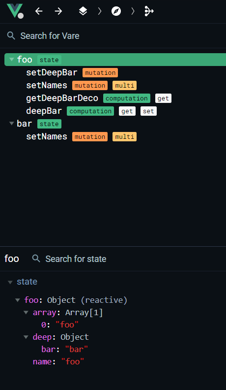
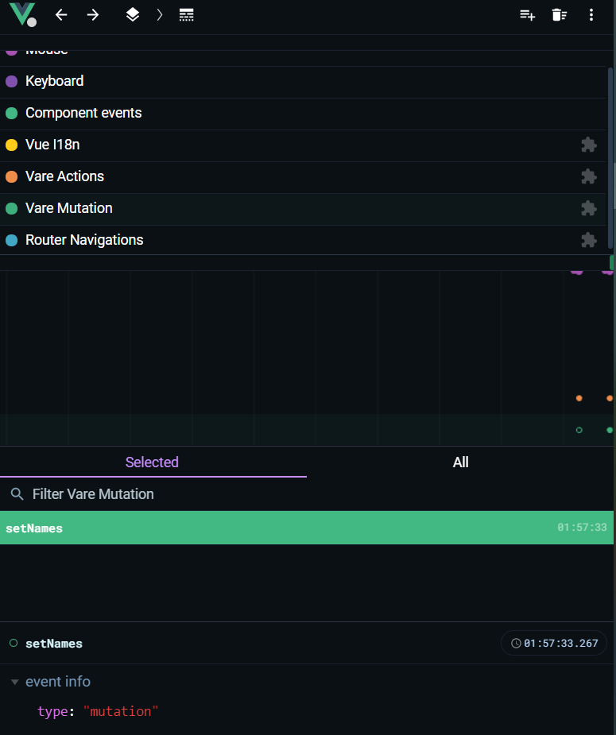

# Vare

Vue Share State for Vue components

## What is this?

Vare works like Vuex.

However, Vare is less painful to create a Store than Vuex.

## Use Vare with Vue (Vue 3.0 or Vue 2 with @vue/composition-api) 

```typescript

import {state} from './src/index'
import {defineComponent, h} from 'vue'

export const myState = state({
  name: 'foo',
})

export const FooComponent = defineComponent(() => {
  const name = computed(() => (myState.name))
  return () => {
    return h('span', name.value)
  }
})

```

## State

```typescript
import {state} from './src/index'
import {defineComponent, computed, h} from 'vue'

const myState = state({
  name: 'foo',
})

// using state in a components
export const FooComponent = defineComponent(() => {
  const name = computed(() => (myState.name))
  return () => {
    return h('span', name.value)
  }
})


```

## Mutation

```typescript
import {state, mutate} from './src/index'
import {defineComponent, h} from 'vue'

const myState = state({
  name: 'foo',
})

// mutation like Vuex Mutation
const setName = mutate((name: string) => {
  myState.name = name
})

// using state in a components
export const FooComponent = defineComponent(() => {
  const name = computed(() => (myState.name))
  return () => {
    return h('div', [
      h('span', name.value),
      h('button', {onclick: () => setName('bar')}, 'click')
    ])
  }
})

```

## Action

store/profile.ts
```typescript
import {state, mutate, act} from './src/index'
import {h} from 'vue'

const myState = state({
  name: 'foo',
})

// mutation like Vuex Mutation
export const setName = mutate((name: string) => {
  myState.name = name
})

// action like Vuex Action
export const requestName = act((name: string) => {
  return Promise.resolve().then(() => {
    setName(name)
  })
})

export const FooComponent = defineComponent(() => {
  const name = computed(() => (myState.name))

  return () => {
    return h('div', [
      h('span', name.value),
      h('button', {onclick: () => requestName('bar')}, 'click')
    ])
  }
})
```

## Compute (Getter)

store/profile.ts
```typescript
import {state, compute, mutate} from './src/index'
import {Ref, h, defineComponent, computed, ref} from 'vue'

const myState = state({
  name: 'foo',
})

// mutation like Vuex Mutation
export const setName = mutate((name: string) => {
  myState.name = name
})

export const getDecoName = compute(() => (`~~${myState.name}~~`))

export const getCustomDecoName = compute((deco: string) => `${deco}${myState.name}${deco}`)

export const getReactiveCustomDecoName = compute((deco: Ref<string>) => {
  return `${deco.value}${myState.name}${deco.value}`
})

export const FooComponent = defineComponent(() => {
  const decoName = getDecoName()
  const customDecoName = getCustomDecoName('++')
  const customDeco = ref('--')
  const customReactiveDecoName = getReactiveCustomDecoName(customDeco)

  function handleInput(event) {
    customDeco.value = event.target.value
  }

  return () => {
    return h('div',
      h(Fragment, [
        h('span', decoName.value), // ~~foo~~
        h('span', customDecoName.value), // ++foo++
        h('input', {onInput: handleInput, value: customDeco.value}), // --foo--
        h('button', {onclick: () => setName('bar')}, 'click')
      ])
    )
  }
})
```

## Subscribe

```typescript
import {state, mutate, act, subscribe, unsubscribe} from './src/index'
import {h} from 'vue'

const myState = state({
  name: 'foo',
})

// mutation like Vuex Mutation
export const setName = mutate((name: string) => {
  myState.name = name
})

// action like Vuex Action
export const requestName = act((name: string) => {
  return Promise.resolve().then(() => {
    setName(name)
  })
})

export const getDecoName = compute(() => (`~~${myState.name}~~`))()

const hook = () => {
  // any
}

const stopMyState = subscribe(myState, hook)

const stopSetName = subscribe(setName, hook)

const stopRequestName = subscribe(requestName, hook)

const stopGetDecoName = subscribe(getDecoName, hook)

// unsubscribe
stopMyState()
stopSetName()
stopRequestName()
stopGetDecoName()

```

## Naming (for devtool)

```typescript
import {state, compute, mutate, getName} from './src/index'

const foo = state({
  name: 'foo'
}, 'foo')

const getFooName = compute(() => (foo.name), 'getFooName')
const setFooName = mutate((name: string) => {
  foo.name = name
}, 'setFooName')

getName(foo) // foo
getName(getFooName) // getFooName
getName(setFooName) // getFooName

```

Are you sick of naming? 

Try to make a tree!
```typescript
import {state, compute, mutate, getName, act} from './src/index'

const foo = state({
  age: 999
})

export const computations = compute({
  getAge: () => (foo.age)
})

export const mutations = mutate({
  setAge: (age: number) => {
    foo.age = age
  }
})

export const actions = act({
  updateAge: (age: number) => {
    return Promise.resolve().then(() => {
      mutations.setAge(age)
    })
  }
})

const tree = {
  state: foo,
  ...computations,
  ...mutations,
  ...actions,
}

const age = tree.getAge() // 99
tree.setAge(0)
getName(tree.getAge) // 'getAge'
getName(tree.setAge) // 'setAge'
getName(tree.updateAge) // 'updateAge'

```


## Why 

Share state wherever you want

Recoil x Vuex x Immer

### Recoil


```typescript
function App() {
  return (
    h(RecoilRoot, null,
      h(FooComponent),
      h(BarComponent)
    )
  )
}

// ....

const _state = atom({
  key: '...',
  default: {name: 'foo'}
})

const foo = selector({
  key: '...',
  get: ({get}) => {
    return get(_state).name
  },
  set: ({set, get}, name) => {
    set(_state, {
      ...get(_state),
      name,
    })
  }
})

function FooComponent() {
  const state = useRecoilValue(_state)
  
  return (
    h('div', null, state.foo)
  )
}

function BarComponent() {
  const setState = useSetRecoilState(foo)

  return (
    h('div', {onClick: () => setState('bar')})
  )
}

```
In the vare way
```typescript
// no need a context

const myState = state({
  name: 'foo',
})


const getName = compute(() => myState.name)

const setName = mutate((name: string) => {
  myState.foo = name
})

const App = defineComponent(() => {
  return () => h('div', [
    h(FooComponent),
    h(BarComponent)
  ])
})

const FooComponent = defineComponent(() => {
  const name = getName()
  
  return () => (
    h('div', name.value)
  )
})

const BarComponent = defineComponent(() => {
  return () => {
    h('div', {onclick: () => setName('bar')})
  }
})

```

### Immer 

```typescript
const myState = {
  foo: 'foo'
}

produce(myState, (draft) => {
  draft.foo = 'bar'
})

```

In the Vare way
```typescript
const myState = state({
  foo: 'foo',
})

myState.foo = 'bar'
```

### Vuex

```typescript
import {createStore} from 'vuex'

const store = createStore({
  state () {
    return {
      count: 0
    }
  },
  mutations: {
    increment: (state) => {
      state.count++
    }
  },
  actions: {
    request: () => {
      store.commit('increment')
    },
  },
  getters: {
    getCount: (state) => {
      return state.count
    },
  }
})

// need to setup
app.use(store)

const FooComponent = defineComponent(() => {
  const store = useStore()

  return () => (
    h('div', [
      h('div', store.state.count),
      h('a', {onClick: () => store.commit('increment')}),
    ])
  )
})
```

In the Vare way
```typescript
import {mutate, state, act, compute} from './src/index'
// no need to setup

const myState = state({
  count: 0,
})

const mutations = mutate(myState, {
  increment: (state) => {
    state.count++
  }
})

const actions = act({
  request: () => {
    mutations.increment()
  }
})

const computations = compute(myState, {
  getCount: (state) => (state.count) 
})

const store = {
  state: myState,
  ...mutations,
  ...actions,
  ...computations,
}

const FooComponent = defineComponent(() => {
  const count = computed(() => (store.state.count))

  return () => (
    h('div', [
      h('div', count.value),
      h('a', {onClick: store.increment}),
    ])
  )
})
```

## Create the pack in easy way (WIP)


## Supporting Vue DevTool ?

Yes!




